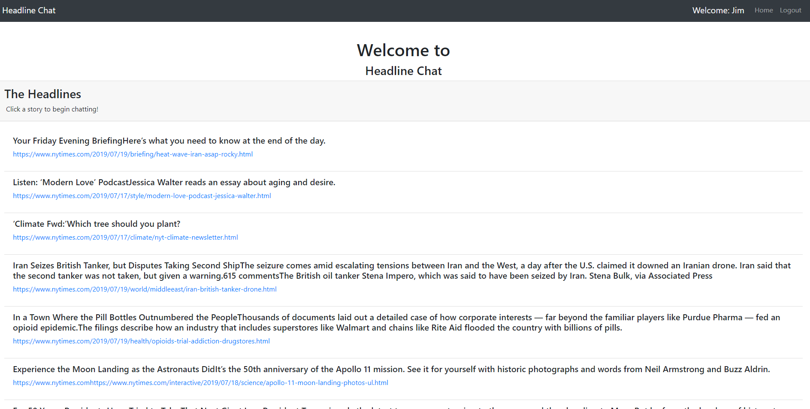
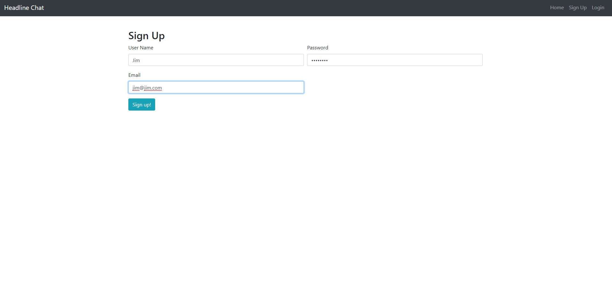
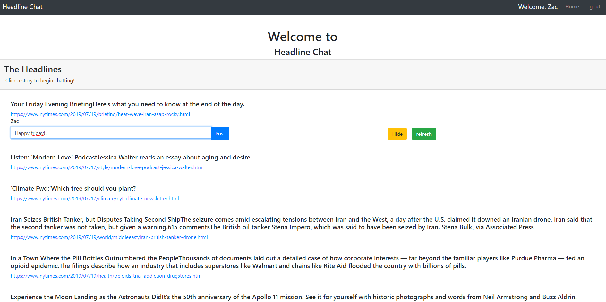
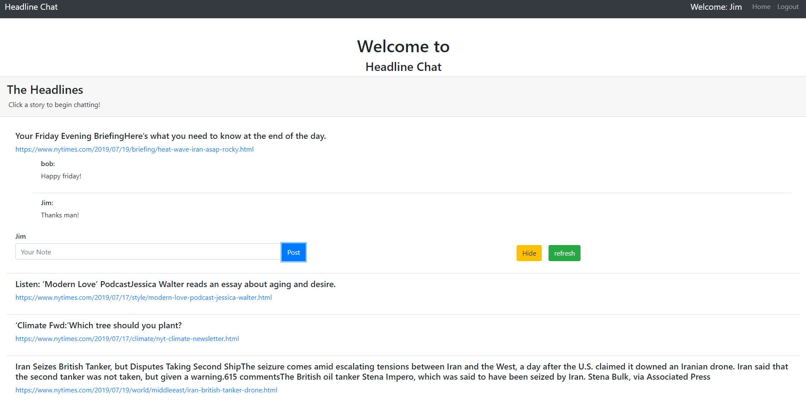

# mongoScrape
scrapes headlines from nytimes.com
users can then log in a chat about the stories
hold chat in db like a forum unique for each story

### Deployed on heroku
##### if the db sleeps you can reload the scrape by going to: 
https://headlinechat.herokuapp.com/api/scrape

##### test account:
user name: testAccount
password: password

### deployed link:
https://headlinechat.herokuapp.com/

### Technologies Used:
* node 
* express
* MongoDb
* Mongoose
* Axios
* Jquery
* passport.js
* express-sessions

### Pictures of it in use! 
###### main page:

###### Sign Up:

###### User posting: 

###### Chat:

